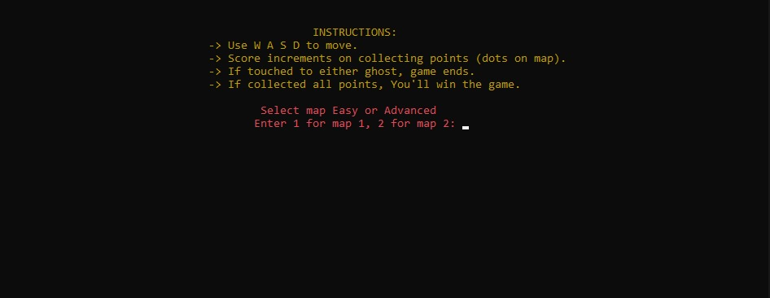
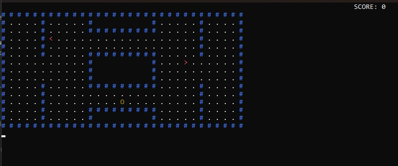
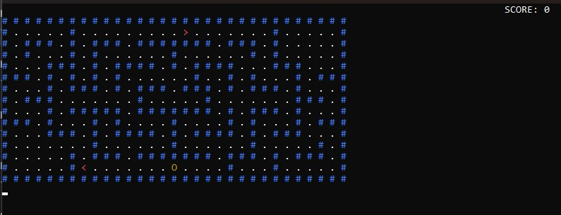

# 🕹️ Classic Pacman Console Game (C++)

[](https://isocpp.org/)
[](https://windows.com)
[](https://opensource.org/licenses/MIT)

## 📌 Repository Description
**Console-based Pacman clone** featuring:
- Two difficulty maps
- Auto-driven ghost enemies
- Score tracking system
- Colorful terminal UI
- Win/loss conditions

## 🖼️ Screenshots
<div align="center">
  
   
  
</div>

## 🚀 Quick Start
1. Download [main.cpp](main.cpp)
2. Compile & run:
   ```bash
   g++ main.cpp -o pacman
   ./pacman
